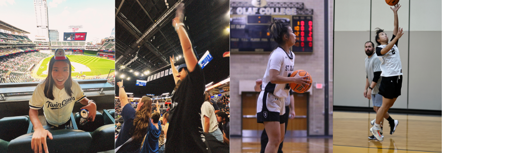

### Experience

**Analytics Leadership Development Program (ALDP)** <br> 
Ameriprise Financial \| Minneapolis, MN \| June 2025 - Present <br>

<div style="margin-left: 2em;">

**Risk Protection Services LFO** <br> 
Feb 2026 - Present <br>

**Enterprise Data, Analytics, and Insights** <br>
June 2025 - Feb 2026 <br>

-   Built and validated long-term IRA retirement outflow forecasts to inform business planning using age-segmented analytical and machine learning approaches
-   Engineered scalable SQL and Python data pipelines for multi-year IRA flows and client demographics, applying attrition logic to support forecasting and trend analysis
-   Analyzed J.D. Power churn survey data to identify behavioral and demographic drivers of client attrition across financial products

</div>

**Data Science 1 Tutor** <br> 
St. Olaf College \| Northfield, MN \| Sept 2023 - May 2025 <br>

-   Serve as an academic role model for students taking Data Science 1 (Introduction to R) by exhibiting positive study strategies, and time management skills
-   Schedule and host tutoring sessions
-   Complete administrative tasks in a timely and efficient manner (emails, timecards, tutoring notes, etc.)

**Service Desk Intern** <br> 
Cambria \| Eden Praire, MN \| May 2023 - August 2023 <br>

-   Capstone Project: Windows 11 Implementation: Collaborate with Cambria Security & System Engineering Team to rollout strategies and group policy configurations to satisfy company needs
-   Utilize software such as: Windows Active Directory Administration for onboarding, offboarding & employee management, Jamf to manage and secure Apple devices, Jira administration for resolving tickets, Asset Panda to manage IT assets (quantity, location, cost, etc.)

### Education

**St. Olaf College \| Northfield, MN** <br> 
B.A in Mathematics \| Sept 2022 - May 2025

**Portland Community College \| Portland, OR** <br> 
Transfer \| Sept 2021 - June 2022


### Fun Facts!

- I super enjoy going to sporting events, particularly basketball and baseball games. The atmosphere in the arena and the intensity of the competition is super fun. I also played Division 3 basketball, so I love playing as well! 
```{r}
#| echo: false

```
::: {.center-text .extra-small-text .dark-gray-text .topbr} 
Photos of sports events I've attended and photos of me playing sports!
::: 

- I love going to concerts and music! My very first concert was in 2021 and since then I've been to 26 total concerts and one 3-day long festival. I have a shoe that I call my concert shoe in which I get artists to sign, it has about 10 autographs on it right now. I was also featured in a YouTube short video posted by Dean Lewis that has 5+ million views and 315k likes.

- Two of my favorite hobbies are taking photos and hiking. These work very well together because I can take photos while hiking. I hope to rekindle my passion for these hobbies and maybe even get into some sports photography. 

```{r}
#| echo: false
knitr::include_graphics("images/yellowstone.jpg")
```
::: {.center-text .extra-small-text .dark-gray-text .topbr} 
This is one of my top 5 favorite photos I've ever taken. Located at Yellowstone National Park, my dad standing in a grass field
::: 

- My top two favorite foods are a bowl of pho or sushi. If money or nutrition wasn't in the picture, I would be very happy just eating those two things. I've worked at two sushi resturants and was able to learn how to cut some types of fish and roll sushi. Something else I really enjoy would be softserve matcha icecream, there's a shop in Portland that I used to go to 2 or 3 times a week because it was just that good.