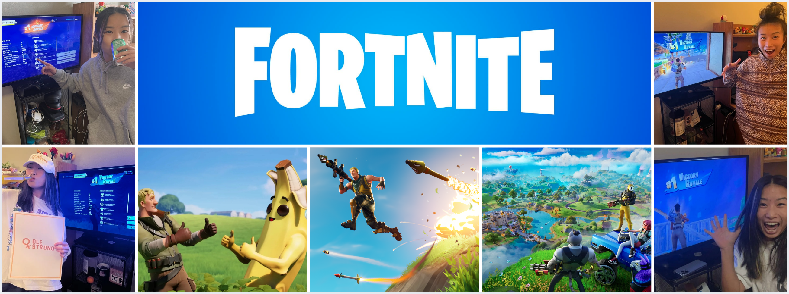

```{r, include = FALSE}
library(tidyverse)
library(stringr)
library(rvest)
library(polite)
library(httr2)
library(httr)
library(lubridate)
library(purrr)
library(kableExtra)
library(rjson)
library(bslib)
```

```{r, include = FALSE}
# API key
fortniteapi <- Sys.getenv("fortniteapi")
fortniteaccount <- Sys.getenv("fortniteaccount")

response <- GET(
  str_c("https://fortnite-api.com/v2/stats/br/v2/", fortniteaccount),
  add_headers(Authorization = fortniteapi)
)

# Check response status
print(response$status_code)

# Parse JSON response
details <- content(response, as = "text")

details <- fromJSON(details)

# Retrieve all stats
global_stats <- details$data$stats$all
details$data$battlePass
```

```{r}
year <- today() |> year()
month <-today() |> month()

time_period <- paste(month, year)
```

```{r, include = FALSE}
# Data Wrangling GLOBAL STATS

# Overall stats
overall_stats <- global_stats$overall

# Game mode stats
solo_stats <- global_stats$solo
duo_stats <- global_stats$duo
squad_stats <- global_stats$squad


# Total stats
total_wins <- tibble(
  total_wins = overall_stats$wins
)

total_kills <- tibble(
  total_kills = overall_stats$kills
)

total_matches <- tibble(
  total_matches = overall_stats$matches
)


# Function for game mode specific stats
create_stats <- function(gamemode){

  c(
    gamemode$wins,
    str_c(gamemode$winRate, "%"),
    gamemode$kills,
    gamemode$matches
  )

}


# Create game mode specific stats
solo <- create_stats(solo_stats)

duo <- create_stats(duo_stats)

squad <- create_stats(squad_stats)


# Function for value boxes
mode_value <- function(title, dataset, icon, color){
  value_box(
    title = title,
    value = dataset[1],
    showcase = bsicons::bs_icon(icon),
    theme = value_box_theme(bg = color, fg = "white")
  )
}

winrate_value <- function(dataset, color){
  value_box(
    title = "Win Rate",
    value = dataset[2],
    theme = value_box_theme(bg = color, fg = "white")
  )
}

kills_value <- function(dataset, color){
  value_box(
    title = "Kills",
    value = dataset[3],
    theme = value_box_theme(bg = color, fg = "white")
  )
}

matches_value <- function(dataset, color){
  value_box(
    title = "Matches",
    value = dataset[4],
    theme = value_box_theme(bg = color, fg = "white")
  )
}


# Function for gold value boxes
gold_box <- function(title, dataset, icon){
  value_box(
    title = title,
    value = dataset |> pull(),
    showcase = bsicons::bs_icon(icon),
    theme = value_box_theme(bg = "#f3af19", fg = "white"),
    fullscreen = FALSE
  )
}
```

# Gameplay Stats

## Lifetime Stats
## Row {height="25%"}

```{r}
gold_box("Total Wins", total_wins, "trophy")

gold_box("Total Kills", total_kills, "crosshair")

gold_box("Total Matches", total_matches, "controller")

gold_box(
  "Hours Played",
  tibble(hours_played = round(overall_stats$minutesPlayed / 60, 1)),
  "clock"
)
```

## Row {height="20%"}
```{r}
value_box(
  title = "Lifetime Score",
  value = format(overall_stats$score, big.mark = ","),
  showcase = bsicons::bs_icon("star"),
  theme = value_box_theme(bg = "#7B61FF", fg = "white")
)

value_box(
  title = "K/D",
  value = overall_stats$kd,
  showcase = bsicons::bs_icon("crosshair"),
  theme = value_box_theme(bg = "#7B61FF", fg = "white")
)

value_box(
  title = "Win Rate",
  value = paste0(overall_stats$winRate, "%"),
  showcase = bsicons::bs_icon("trophy"),
  theme = value_box_theme(bg = "#7B61FF", fg = "white")
)
```

## Stats By Gamemode

## Row {height="15%"}
```{r}
mode_value("Solo Wins", solo, "1-square", "#1B90DD")
winrate_value(solo, "#1B90DD")
kills_value(solo, "#1B90DD")
matches_value(solo, "#1B90DD")
```

## Row {height="15%"}
```{r}
mode_value("Duo Wins", duo, "2-square", "#6DB8FA")
winrate_value(duo, "#6DB8FA")
kills_value(duo, "#6DB8FA")
matches_value(duo, "#6DB8FA")
```

## Row {height="15%"}
```{r}
mode_value("Squad Wins", squad, "4-square", "#6AE2FD")
winrate_value(squad, "#6AE2FD")
kills_value(squad, "#6AE2FD")
matches_value(squad, "#6AE2FD")
```


# About

```{r}
#| echo: false

```


Fortnite is an online battle royale game developed by Epic Games; players are dropped onto an island and compete to be the last one standing. In the game, you can collect weapons, build structures, and strategize to survive against other players. While the game encourages different playstyles, no matter how you decide to play, one of the most exciting aspects is outlasting all other opponents and securing a Victory Royale. Whether you prefer aggressive combat, stealthy tactics, or creative building, there are multiple ways to succeed in the game.

This dashboard looks into my personal statistics for the game of Fortnite and was created and designed by myself, Ziling Zhen. I have played this game since Chapter 2: Season 3, which released in 2020. Code for this dashboard can be found [here](https://github.com/z1l1ng/z1l1ng.github.io/blob/main/projects/fortnite_folder/fortnite_dashboard.qmd).

The data was acquired from a third party API [Fortnite API IO](https://fortniteapi.io/). Gameplay statistics include my all-time total wins (Victory Royales), total kills, and total matches played. These stats are also broken down by game mode: solos, duos, and squads.